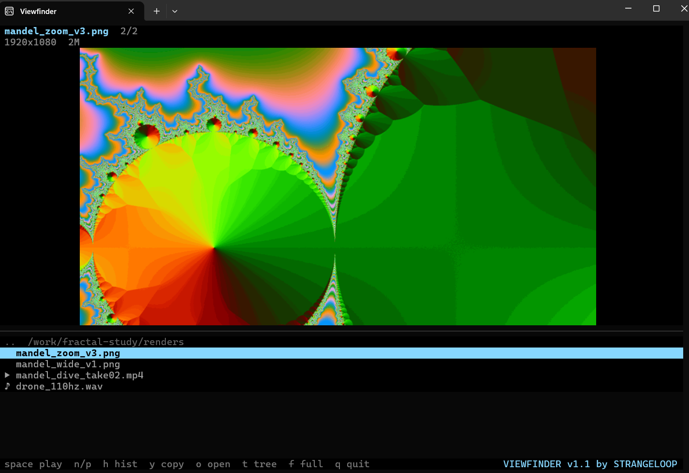

# Viewfinder v1.1

**A media pane beside your AI coding agent.** When Claude Code reads an image, it shows up here, sharp, in your terminal. Video plays at full frame rate. Audio gets a waveform. Nothing to type.



## Why this exists

Claude Code can read an image and reason about it, but the terminal it runs in never shows that image to you. To see what the agent is looking at, you leave the terminal and open the file somewhere else. The chat app and the VS Code extension render images inline. The terminal does not, and for a lot of people the terminal is the point.

Graphics-capable terminals don't solve this on their own. WezTerm, kitty, Ghostty, iTerm2, and Windows Terminal can all draw real images with Sixel or the Kitty graphics protocol, but Claude Code repaints its entire screen many times a second, and anything drawn into that screen is erased on the next frame. Several open issues track this ([#36476](https://github.com/anthropics/claude-code/issues/36476), [#54546](https://github.com/anthropics/claude-code/issues/54546), [#6389](https://github.com/anthropics/claude-code/issues/6389)) and there is no fix, because the fix is architectural.

The image has to live somewhere the agent isn't. Viewfinder is a second pane that the agent does not own. A small hook reports which file the agent just read, and the pane draws it. The terminal, the scrollback, and the keybindings stay exactly as they were.

Around that core are the things a review pane needs: video as a contact sheet with a real player behind it, audio as a waveform, a tree of the folder around the file, a history grouped by project so parallel agents stay separate, and a key that copies the path for the next tool.

## Install

Requires Python 3.12+ and [ffmpeg](https://ffmpeg.org). [mpv](https://mpv.io) is optional but recommended for video and audio playback.

```sh
uv tool install viewfinder        # or: pipx install viewfinder
```

Until the PyPI release lands you can install straight from GitHub:

```sh
uv tool install git+https://github.com/wexloops/viewfinder
```

## Use

```sh
vf open              # split the current terminal and start the pane
vf show FILE...      # push anything to it, from any shell, script, or agent
vf setup claude      # add the Claude Code hook so reads show up automatically
vf                   # run the pane in the current terminal (any split you made yourself)
```

`vf open` knows Windows Terminal, tmux, WezTerm, and kitty. Anywhere else, make a split and run `vf`.

`vf setup claude` adds one PostToolUse hook to `~/.claude/settings.json`. It is equivalent to:

```json
"hooks": {"PostToolUse": [{"matcher": "Read|mcp__filesystem__read_media_file",
  "hooks": [{"type": "command", "command": "vf hook claude", "async": true}]}]}
```

Codex CLI: `vf hook codex` accepts the same payload shape. Experimental, untested against a live Codex hook.

## Keys

| key | action |
|---|---|
| arrows | move through the list, the viewer previews as you go |
| enter / click | open a folder, or show a file |
| space | play video or audio with mpv. ESC or q comes back |
| n / p | next / previous in history |
| h | toggle the bottom panel between folder tree and history grouped by project |
| y / Y | copy the path / the native (Windows) path |
| o | open in the OS default app |
| t | show or hide the bottom panel |
| f | fullscreen the viewer |
| backspace | tree: up one directory |
| q | quit |

## What it shows

- **Images**: png, jpg, gif, webp, bmp, tiff. Rendered with Sixel or the Kitty graphics protocol, letterboxed on black.
- **Video**: a 4x3 contact sheet on arrival, mpv playback on space.
- **Audio**: a waveform on arrival, mpv playback on space.

History is stored as JSONL in `~/.viewfinder/history.jsonl`, tagged with the agent's working directory and session, so parallel agents on different projects stay separated.

## Terminals

| terminal | images | status |
|---|---|---|
| Windows Terminal 1.22+ (incl. WSL) | Sixel | tested |
| WezTerm | Sixel | tested |
| kitty, Ghostty | Kitty graphics | should work, untested |
| iTerm2 | Sixel | should work, untested |
| others | half-cell blocks | fallback |

Force a protocol with `vf --protocol sixel|tgp|halfcell|unicode` if detection gets it wrong.

## How it works

`vf show` writes a path to `~/.viewfinder/queue`. The pane polls that file four times a second and renders whatever lands there. The Claude Code hook is a five-line adapter that extracts the file path from the tool call and calls `vf show`. That is the whole protocol, so any tool can drive Viewfinder with one line of shell.

## License

MIT. Built by [David Wexler](https://strangeloop-studios.com) at Strangeloop Studios.
